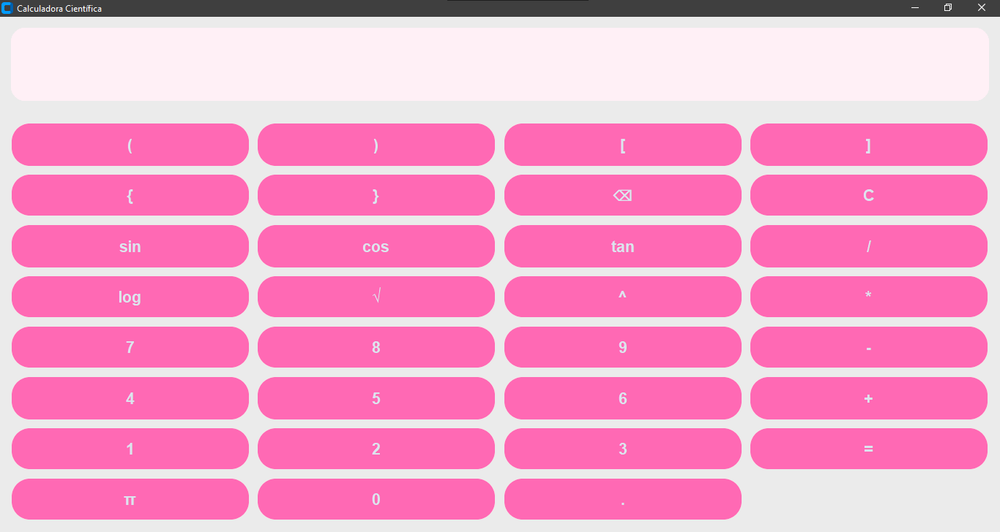
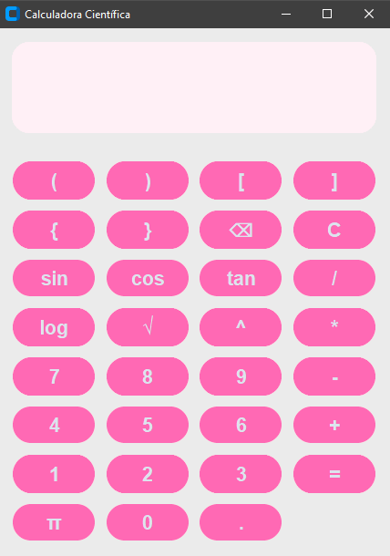

# Calculadora Científica em Python

Projeto de uma calculadora científica com interface gráfica desenvolvida em Python utilizando Tkinter e CustomTkinter.

## Funcionalidades

- Operações matemáticas básicas
- Funções científicas
- Seno, cosseno e tangente
- Logaritmo
- Potência
- Raiz quadrada
- Número π
- Botão de apagar individual (⌫)
- Interface personalizada em tons de rosa
- Símbolos coloridos no visor
- Layout inspirado em calculadoras científicas reais

## Tecnologias utilizadas

- Python
- Tkinter
- CustomTkinter

## Objetivo

Este projeto foi desenvolvido com foco em praticar:

- lógica de programação
- criação de interfaces gráficas
- manipulação de eventos
- personalização visual
- organização de código


## Preview Desktop



## Preview Compacto



## Como executar

Instale o CustomTkinter:
```bash
pip install customtkinter
```
Depois execute:
```bash
py main.py
```

## Desenvolvido por
Marienny Azevedo
